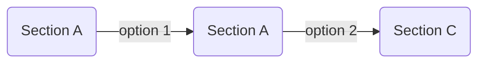
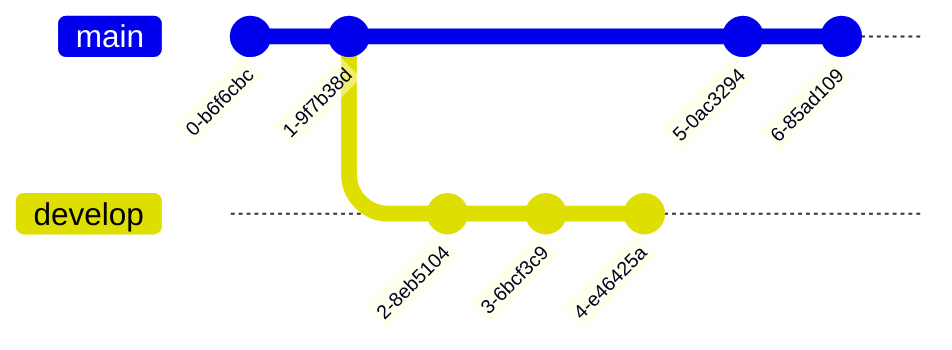

## emoji 表情包


<!-- tab 效果演示 -->
内置了可配置的表情标签     使用方法如下：

```




```

<!-- tab 语法格式 -->

```

```

其中 `source` 可省略，默认为配置中的第一个 `source`（详见「引入表情包」部分）


如果对高度有特别要求，可以指定高度，例如：
```

```



> 表情速查表：[Stellar内嵌blobcat小表情](https://weekdaycare.cn/posts/emoji-blob/)

<!-- tab 引入表情包 -->

```yaml blog/_config.stellar.yml
tag_plugins:
  ...
  emoji:
    default: https://gcore.jsdelivr.net/gh/cdn-x/emoji/qq/${name}.gif
    twemoji: https://gcore.jsdelivr.net/gh/twitter/twemoji/assets/svg/${name}.svg
    qq: https://gcore.jsdelivr.net/gh/cdn-x/emoji/qq/${name}.gif
    aru: https://gcore.jsdelivr.net/gh/cdn-x/emoji/aru-l/${name}.gif
    tieba: https://gcore.jsdelivr.net/gh/cdn-x/emoji/tieba/${name}.png
```

> 在配置文件中，文件名用 `${name}` 代替。




## mark 标记标签

支持多彩标记，包括：            一共 12 种颜色。

```
支持多彩标记，包括：            一共 12 种颜色。
```


## hashtag 标签






如果没有指定颜色，且没有设置默认颜色，则随机取一个颜色，快来试试吧～

```




```

## image 图片标签

图片标签是一个精心设计的应对各种尺寸插图的标签，对于大图，可以放置一个「下载」按钮，语法格式如下：

```

```

```yaml 参数说明
src: 图片地址
description: 图片描述
download: href # 下载地址，设置此值后鼠标放在图片上会显示下载地址，如果下载地址为图片地址，可以设置为 true
width: 200px # 图片宽度
padding: 16px # 图片四周填充宽度
bg: '#ffffff' # 图片区域背景颜色，16进制
```

### 大尺寸图片

无论在什么宽度的设备上都希望横向铺满的图片，一般不需要额外操作。可以在链接后面写上图片描述，如有必要，可以通过设置 `download:true` 使其显示一个「下载」按钮链接指向图片地址，如果下载链接与显示的图片地址不同，可以 `download:下载链接` 来使其能够下载原图。




```md 写法如下


```

### 小尺寸图片优化

宽度较小而高度较大的图片，可以设置宽、高、填充间距、背景色等对其布局进行优化，使得它在不同宽度的屏幕下都能获得不错的视觉体验：



<!-- tab 有底色的图片 -->

有底色的图片，可以填充图片底色：



```

```







<!-- tab 没有底色的图片 -->

没有底色的图片，可以填充 `bg:var(--card)` 动态颜色，能够适配暗黑模式：



```

```



### 支持 Fancybox 插件点击放大

由于 Stellar 主题的插件具有按需加载的特性，所以 Fancybox 插件默认也是已经配置好了的，在任意 `image` 标签中增加 `fancybox:true` 参数即可为特定图片开启缩放功能。如果一个页面没有任何地方使用，则不会加载 Fancybox 插件。



如果您希望全站所有的 `image` 标签都开启此功能，可在主题配置文件中修改以下参数：

```yaml blog/_config.stellar.yml
######## Tag Plugins ########
tag_plugins:
  # 
  image:
    fancybox: false
    parse_markdown: true # 1.19.0 支持把 markdown 格式的图片解析成图片标签 
```

## quot 引用

适合居中且醒目的引用：

支持自定义引号：

其中自定义引号素材在主题配置文件的 `tag_plugins.quot` 中配置：

```yaml
tag_plugins:
  ...
  # 
  quot:
    default: # 可以自行配置多种图标方案
      prefix: https://bu.dusays.com/2022/10/24/63567d3e092ff.png
      suffix: https://bu.dusays.com/2022/10/24/63567d3e0ab55.png
    hashtag:
      prefix: https://bu.dusays.com/2022/10/24/63567d3e07da3.png
```


```
适合居中且醒目的引用：
支持自定义引号：、
```




> 此外，加上 `el:h2/h3/h4/h5/h6` 可以作为标题使用

## poetry 诗词



<!-- tab 示例 -->


莫笑农家腊酒浑，丰年留客足鸡豚。
**山重水复疑无路，柳暗花明又一村。**
箫鼓追随春社近，衣冠简朴古风存。
从今若许闲乘月，拄杖无时夜叩门。


<!-- tab 写法 -->
```

莫笑农家腊酒浑，丰年留客足鸡豚。
**山重水复疑无路，柳暗花明又一村。**
箫鼓追随春社近，衣冠简朴古风存。
从今若许闲乘月，拄杖无时夜叩门。

```


## note 备注块



<!-- tab 示例 -->
```md

```
<!-- tab 写法 -->
```yaml
title: 标题（可选）
content: 内容
color: red/orange/yellow/green/cyan/blue/purple/light/dark/warning/error
```



### 具有标题的备注块

直接写备注内容，默认是和代码块一样的样式，第一个空格前面的是标题，后面的是正文，如果标题中需要显示空格，请使用 `&nbsp;` 代替。



<!-- tab 示例 -->

<!-- tab 写法 -->
```

```



### 彩色备注块




<!-- tab 示例 -->












<!-- tab 写法 -->
```md


```


## okr 目标管理

这个功能在  版本后开始支持，这是一个 OKR（Objectives and Key Results）示例：



2024年的小目标：完成 Volantis 6.0 并发布上线
来自2025年的复盘：已《基本》实现目标 

<!-- okr kr1 percent:1 -->
重构 tag-plugins 和 wiki 系统
- 当  进度为 100% 时，标签默认显示为 
- 当  未设置进度时，默认为 {% mark 0% %}
- 当  未设置进度时，则显示所有  进度平均值

<!-- okr kr2 percent:0.9 status:off_track -->
完成主要页面设计稿

<!-- tab 小提示1 -->
您可以在 _config.yml 文件中修改标签的颜色和文案
<!-- tab 小提示2 -->
您可以在 _config.yml 文件中增加任意的标签配置


<!-- okr kr3 percent:-0.12 status:unfinished -->
完成前置准备工作（如果你知道答案，请在留言区帮帮我！🥹）






<!-- okr kr-4 status:at_risk -->
开发、测试和发布




写法如下：

```


2024年的小目标：完成 Volantis 6.0 并发布上线
来自2025年的复盘：已《基本》实现目标 

<!-- okr kr1 percent:1 -->
重构 tag-plugins 和 wiki 系统
- 当  进度为 100% 时，标签默认显示为 
- 当  未设置进度时，默认为 {% mark 0% %}
- 当  未设置进度时，则显示所有  进度平均值

<!-- okr kr2 percent:0.9 status:off_track -->
完成主要页面设计稿

<!-- tab 小提示1 -->
您可以在 _config.yml 文件中修改标签的颜色和文案
<!-- tab 小提示2 -->
您可以在 _config.yml 文件中增加任意的标签配置


<!-- okr kr3 percent:-0.12 status:unfinished -->
完成前置准备工作（如果你知道答案，请在留言区帮帮我！🥹）





<!-- okr kr-4 status:at_risk -->
开发、测试和发布



```

## link 链接卡片




<!-- tab 效果演示 -->


<!-- tab 语法格式 -->
外链卡片标签的语法格式为：
```

```
参数含义：
```yaml
href: 链接
title: 可选，手动设置标题（为空时会自动抓取页面标题）
icon: 可选，手动设置图标（为空时会自动抓取页面图标）
desc: 可选，是否显示摘要描述，为true时将会显示页面描述
```
<!-- tab 写法示例 -->
```md
不带摘要的样式：

带摘要的样式：

```



## mermaid 图表

安装插件



```yaml blog/_config.stellar.yml
  mermaid:
    enable: false
    # js: https://unpkg.com/mermaid@9.0.0/dist/mermaid.min.js
    js: https://cdn.jsdelivr.net/npm/mermaid@v9/dist/mermaid.min.js
    # Available themes: default | dark | forest | neutral
    theme: neutral
```

使用前需要在 Markdown 文件开头加入

```md
---
mermaid: true
---
```



<!-- tab 演示效果 -->







<!-- tab 代码示例 -->

<script src="https://gist.github.xaox.cc/weekdaycare/f7769263a4df46b2d75e32684f4ae873.js"></script>






## copy 复制行




<!-- tab 示例 -->
对于单行内容，可以使用 `copy` 标签来实现复制功能：



您可以设置 `git:https` 或者 `git:ssh` 或者 `git:gh` 来快速放置一个 git 仓库链接：

<!-- tab 写法 -->
```md





```



## radio 单选




<!-- tab 示例 -->


<!-- tab 写法 -->
```


```
```yaml 支持的参数
checked: true/false
color: red/orange/yellow/green/cyan/blue/purple
```



## checkbox 复选




<!-- tab 示例 -->





<!-- tab 写法 -->
```md





```

```yaml 支持的参数
checked: true/false
color: red/orange/yellow/green/cyan/blue/purple
symbol: plus/minus/times
```




## navbar 导航栏

文章内也可以插入一个导航栏：

```md

```

> active 传入要高亮的那个按钮的 url




## frame 设备框架



<!-- tab 示例 -->

<!-- tab 写法 -->
```md

```



## 文本修饰标签集

- 这是  标签
- 这是  标签
- 这是  标签
- 这是  标签
- 这是  标签
- 这是  标签
- 这是  标签
- 这是  标签，试一试： + 

```md 写法如下
- 这是  标签
- 这是  标签
- 这是  标签
- 这是  标签
- 这是  标签
- 这是  标签
- 这是  标签
- 这是  标签，试一试： + 
```