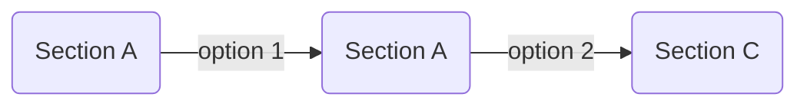
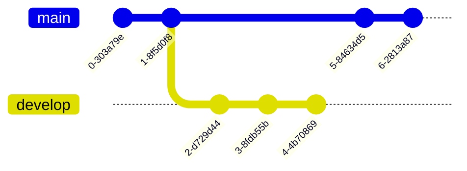

## mermaid

安装插件：



使用前需要在 Markdown 文件开头加入：

```md _posts/xxx.md
---
mermaid: true
---
```



<!-- tab 演示效果 -->





<!-- tab 代码示例 -->

<script src="https://gist.github.xaox.cc/weekdaycare/f7769263a4df46b2d75e32684f4ae873.js"></script>




