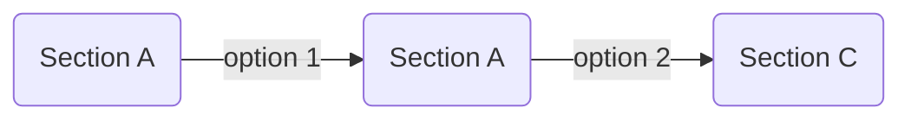
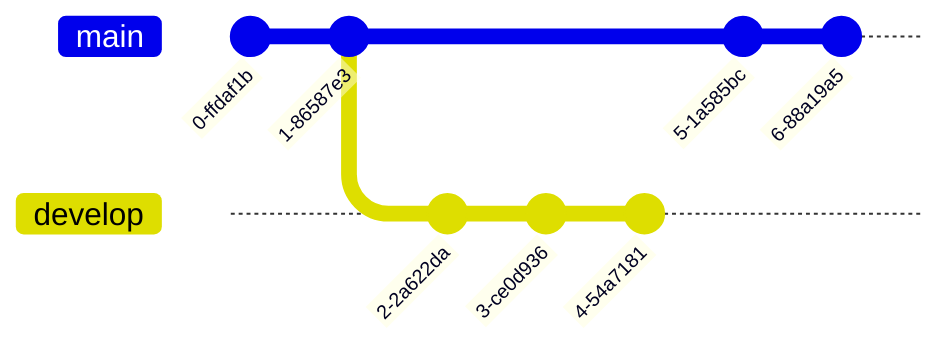

## mermaid

安装插件：



使用前需要在 Markdown 文件开头加入：

```md _posts/xxx.md
---
mermaid: true
---
```



<!-- tab 演示效果 -->


```mermaid
graph LR
A(Section A) -->|option 1| B(Section A)
B -->|option 2| C(Section C)
```


```mermaid
gitGraph
  commit
  commit
  branch develop
  commit
  commit
  commit
  checkout main
  commit
  commit
```

<!-- tab 代码示例 -->

<script src="https://gist.github.xaox.cc/weekdaycare/f7769263a4df46b2d75e32684f4ae873.js"></script>





### 样式配置

主题配置中的 `style_optimization` 用于选择 Mermaid 样式：

```yaml
mermaid:
  style_optimization: false # 默认使用 Mermaid 官方主题
  theme: neutral
```

设置为 `true` 时，才会加载 Stellar 自定义 Mermaid 样式；设置为 `false` 或不配置时使用 Mermaid 官方主题。若图表中的文字、箭头或边标签不可见，建议先使用默认的官方主题进行排查。
