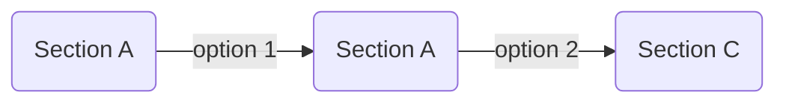

## mermaid

安装插件：



使用前需要在 Markdown 文件开头加入：

```md _posts/xxx.md
---
render:
  diagrams: mermaid
---
```



<!-- tab 演示效果 -->


```mermaid
graph LR
A(Section A) -->|option 1| B(Section A)
B -->|option 2| C(Section C)
```


```mermaid
gitGraph
  commit
  commit
  branch develop
  commit
  commit
  commit
  checkout main
  commit
  commit
```

<!-- tab 代码示例 -->







### 样式配置

Mermaid 使用官方样式，可在 provider 参数中选择官方主题：

```yaml
extensions:
  features:
    diagrams:
      provider: mermaid
      providers:
        mermaid:
          theme: neutral
```

页面可以用 `render.diagrams: false` 关闭，或用 `mermaid` / Mermaid 参数对象覆盖。
